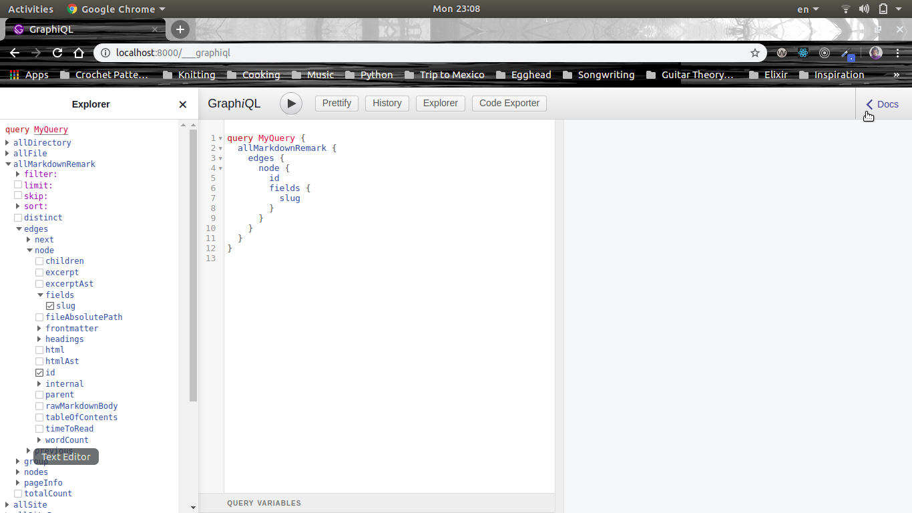
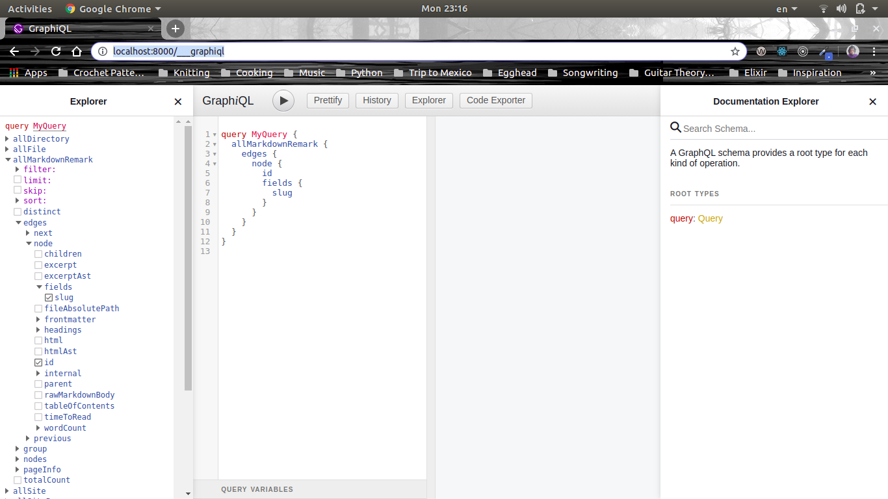
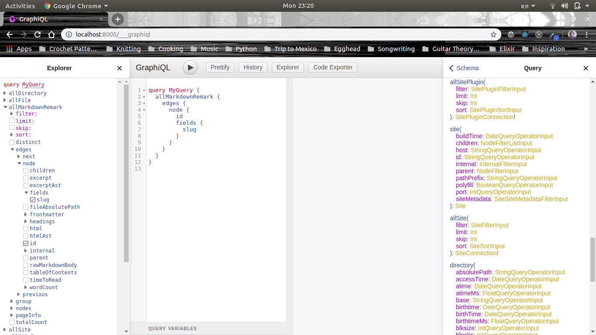

# Use the GraphiQL Browser to Build Queries for Gatsby

GraphQL is a new API standard that provides a more efficient, powerful, and flexible alternative to REST.

**API** - how a client can load data from a server.

GraphQL enables _declarative data fetching_ where a client can specify exactly waht data it needs from an API. Instead of multiple endpoints that return fixed data structures, a GraphQL server only exposes a single endpoint and responds with precisely the data asked for.

Most applications today have the need to fetch data from a server where that data is stored in a database. It’s the responsibility of the API to provide an interface to the stored data that fits an application’s needs.

GraphQL is often confused with being a database technology. This is a misconception, GraphQL is a query language for APIs - not databases. In that sense it’s database agnostic and effectively can be used in any context where an API is used.

GraphQL is a query language (the QL part of its name). If you’re familiar with SQL, it works in a very similar way. Using a special syntax, you describe the data you want in your component and then that data is given to you.

Gatsby uses GraphQL to enable components to declare the data they need.

In order to see what type of data we can query in Gatsby, first start your gatsby development server. **Make sure that you're in the main folder of you Gatsby site**:

`gatsby develop`

Then you can view `GraphiQL`, which is an in-browser IDE that lets you explore your sit'es data and schema by typing this URL into your browser:

`http://localhost:8000/___graphiql`

**Note:** be sure to put three underscores `___` before the word graphql.

Once the IDE is avaiable click in the right hand corner on `Docs`:



This is the **Documentation Explorer** which lets us go through our schema and look for what type of stuff we can query for.





We can click on `Query` under **ROOT TYPES**. This gives us a list of all the things that we can look for.




So, inside GraphiQL on the left hand side where the text editor is located type the following inside of the text editor:

```
site {
  siteMetadata {
    title
    description
  }
}
```

Now press the play button at the top and what you should get in return is `JSON` that looks this:

```JSON
{
  "data": {
    "site": {
      "siteMetadata": {
        "title": "My Blog",
        "description": "This is my cool blog."
      }
    }
  }
}
```

This was the data that was fetched from the `gatsby-config.js` file.

Let's do the same thing for `allMarkdownRemark`:

```
allMarkdownRemark {
  edges {
    node {
      frontmatter {
        title
        path
        date
        excerpt
      }
    }
  }
}
```

You should expect this to return JSON to return all of the front matter from your different markdown files.

Also you can think of `edges` as the file paths and `node` as the individual markdown files.
